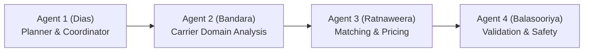

# FreightLink — Agentic AI Service

The Agentic AI service is a Python microservice built with **FastAPI** and **LangGraph** that provides intelligent carrier matching, route optimization, dynamic pricing, and proposal generation for the FreightLink logistics platform.

---

## 1. Architectural Overview

FreightLink employs a sequential four-agent pipeline (ADR-007) to match posted loads with verified carrier agencies:



| Agent | Role | Owner | Key Responsibilities |
|---|---|---|---|
| **Agent 1** | Planner / Coordinator | Dias H.N.P.K. (Component A) | Creates `AgentWorkflowRun`, generates structured execution plan. |
| **Agent 2** | Domain Analysis | Bandara K.A.S.M. (Component B) | Filters compliance, active status, vehicle capabilities; outputs candidate shortlist. |
| **Agent 3** | **Matching & Pricing** | **Ratnaweera O.V. (Component C)** | **Routes candidates via ORS, selects best agency, computes ADR-015 pricing, generates LLM justification, logs tool call telemetry.** |
| **Agent 4** | Validation & Safety | Balasooriya B.K.N.N. (Component D) | Deterministic validation checks, deviation check, pauses for Shipper approval. |

---

## 2. Agent 3: Matching & Pricing (Component C)

**Owner:** Ratnaweera O.V. (`OmiraRathnaweera`)  
**Implementation:** [`src/freightlink_agent/agents/matching_pricing.py`](file:///D:/Y3S1/SEF%20Project/freightLink/agent/src/freightlink_agent/agents/matching_pricing.py)

Agent 3 acts as the **tool-use agent** responsible for selecting the optimal carrier and determining the commercial price for the freight assignment.

### Core Workflow & Logic

1. **Candidate Positioning Routing (Yard $\rightarrow$ Pickup)**
   - For up to the top 3 candidate agencies from Agent 2's shortlist (capped to preserve API quotas and reduce latency), Agent 3 calls the `get_route_and_eta` tool.
   - **Origin:** Agency yard coordinates (ADR-002 single-yard rule).
   - **Destination:** Load pickup coordinates.
   - Computes realistic road distance (km) and estimated positioning time (minutes).

2. **Deterministic Winner Selection & Vehicle Class Resolution**
   - Candidate with the lowest positioning ETA is selected as the winner.
   - Deterministically matches the load requirements (weight and volume) against the agency's fleet capability to assign the most cost-effective vehicle class (`MiniTruck`, `MediumLorry`, or `ContainerTruck`, ADR-019).

3. **Cargo Leg Routing & Pricing (Pickup $\rightarrow$ Dropoff)**
   - Invokes `get_route_and_eta` for the actual cargo leg.
   - Calls the ASP.NET Core backend endpoint (`POST /internal/pricing/estimate`).
   - **Critical Rule (ADR-015 Addendum):** Pricing is strictly calculated on the **cargo transit leg**, never the positioning leg:
     $$\text{Estimated Price} = \text{BaseFare} + (\text{CargoDistanceKm} \times \text{RatePerKm}) + (\text{WeightKg} \times \text{RatePerKg})$$

4. **Natural-Language Shipper Justification (LLM)**
   - Prompts OpenAI (`gpt-4o-mini` by default, with a deterministic rule-based fallback if the call fails) using structured output (`SelectionJustificationOutput`). No Gemini, no Ollama - OpenAI is the only LLM provider.
   - Produces a transparent, human-readable justification grounded strictly in the routing and pricing data (e.g., *"Recommended: Peliyagoda Logistics Express — nearest available carrier with suitable MediumLorry capacity (ETA 11 min to pickup, 7.86 km positioning)..."*).

5. **Auditing & Telemetry Persistence**
   - Records each routing call and pricing attempt as a `ToolCall` audit row via backend endpoint `POST /internal/agent-workflow-runs/{workflowRunId}/tool-calls`.
   - Durably reports step completion as `AgentStep` #3 (`MatchingPricing`, `Succeeded` / `Failed`).

---

## 3. Key Architectural Decision Records (ADRs) Followed

- **ADR-007 (LangGraph Orchestration):** Sequential execution model passing a strongly-typed `WorkflowState`.
- **ADR-008 (LLM Provider & Fallback):** OpenAI only (`gpt-4o-mini` by default) - no Gemini, no Ollama. Each agent falls back to its own deterministic, template-based copy if the OpenAI call fails.
- **ADR-009 (Strict Service Boundary):** Python has **zero direct database access** (no ORM, no connection strings). All reads/writes traverse the internal REST API guarded by `X-Internal-Api-Key`.
- **ADR-012 (OpenRouteService Integration):** Real-world road routing and ETA calculation with graceful fallback simulation.
- **ADR-015 (Pricing Formula & Cargo Leg):** Pricing exclusively applies to the cargo transit movement.
- **ADR-019 / ADR-020 (Vehicle Class & Status Enums):** Strict typing and capacity tier mapping across backend and agent.

---

## 4. Environment Configuration

Copy `.env.example` to `.env` in the `agent/` directory:

```bash
cp .env.example .env
```

| Variable | Description | Default / Example |
|---|---|---|
| `AGENT_API_BASE_URL` | Base URL of this Python service | `http://localhost:8001` |
| `AGENT_SERVICE_PORT` | Port for FastAPI / Uvicorn server | `8001` |
| `LOG_LEVEL` | Logging verbosity (`DEBUG`, `INFO`, `WARNING`, `ERROR`) | `INFO` |
| `OPENAI_API_KEY` | OpenAI API key (the only LLM provider - no Gemini, no Ollama) | `sk-...` |
| `OPENAI_MODEL` | OpenAI model identifier | `gpt-4o-mini` |
| `OPENAI_MAX_CALLS_PER_PROCESS` | Hard per-process cap on OpenAI calls (cost guard) | `200` |
| `OPENROUTESERVICE_API_KEY` | OpenRouteService API key for road routing | `your-ors-api-key` |
| `OPENROUTESERVICE_BASE_URL` | OpenRouteService endpoint | `https://api.openrouteservice.org` |
| `SHARED_SECRET` | Secret token expected in `X-Internal-Api-Key` header | Matches backend `agent-service-api-key` |
| `BACKEND_BASE_URL` | Base URL of the ASP.NET Core API | `http://localhost:5159` |
| `INTERNAL_API_KEY` | Secret token sent when calling backend internal endpoints | Matches backend `INTERNAL_API_KEY` |

> [!NOTE]
> If `OPENROUTESERVICE_API_KEY` is omitted, the routing tool automatically falls back to an internal road detour simulation based on Haversine distance.

---

## 5. Setup & Installation

### Prerequisites
- Python 3.12 or newer
- Virtual environment manager (`uv` recommended, or standard `venv`)

### Setup with virtual environment:
```powershell
# From the agent directory
cd agent

# Create virtual environment
python -m venv .venv

# Activate virtual environment
# Windows PowerShell:
.\.venv\Scripts\Activate.ps1
# Linux / macOS:
source .venv/bin/activate

# Install dependencies
pip install -e .
pip install pytest httpx
```

---

## 6. Running Tests

The test suite validates routing tools, distance math, vehicle class resolution, LLM fallback mechanisms, and step reporting:

```powershell
# Run all agent tests
pytest

# Run tests with verbose output
pytest -v

# Run Agent 3 matching and pricing tests specifically
pytest tests/test_matching_pricing.py -v
```

---

## 7. Interactive Demo CLI Runner

An interactive demo CLI runner is provided in [`scripts/demo_matching.py`](file:///D:/Y3S1/SEF%20Project/freightLink/agent/scripts/demo_matching.py) to demonstrate Agent 3 standalone or against a running backend.

### Features:
- 4 realistic Sri Lankan logistics scenarios:
  1. *Industrial Machinery:* Colombo Port $\rightarrow$ Kandy Industrial Zone
  2. *Perishable Agricultural Produce:* Kurunegala Central Market $\rightarrow$ Hambantota International Port
  3. *Apparel & Garment Logistics:* Katunayake EPZ $\rightarrow$ Galle Harbor
  4. *FMCG Distribution:* Peliyagoda Warehouse $\rightarrow$ Jaffna Town
- Live ORS road routing and ETA calculations.
- Automatic vehicle class resolution and ADR-015 pricing breakdown.
- Live OpenAI natural-language recommendation justification.
- Audit trail simulation (`ToolCall` and `AgentStep` records).

### Execution:

```powershell
# Run all scenarios in batch mode
python scripts/demo_matching.py --all

# Or run interactively to choose a scenario
python scripts/demo_matching.py
```

---

## 8. Running the FastAPI Service

To run the agent API server for backend integration:

```powershell
uvicorn freightlink_agent.main:app --host 0.0.0.0 --port 8001 --reload
```

- **Swagger UI:** `http://localhost:8001/docs`
- **ReDoc:** `http://localhost:8001/redoc`
- **Health Check:** `GET http://localhost:8001/health`
